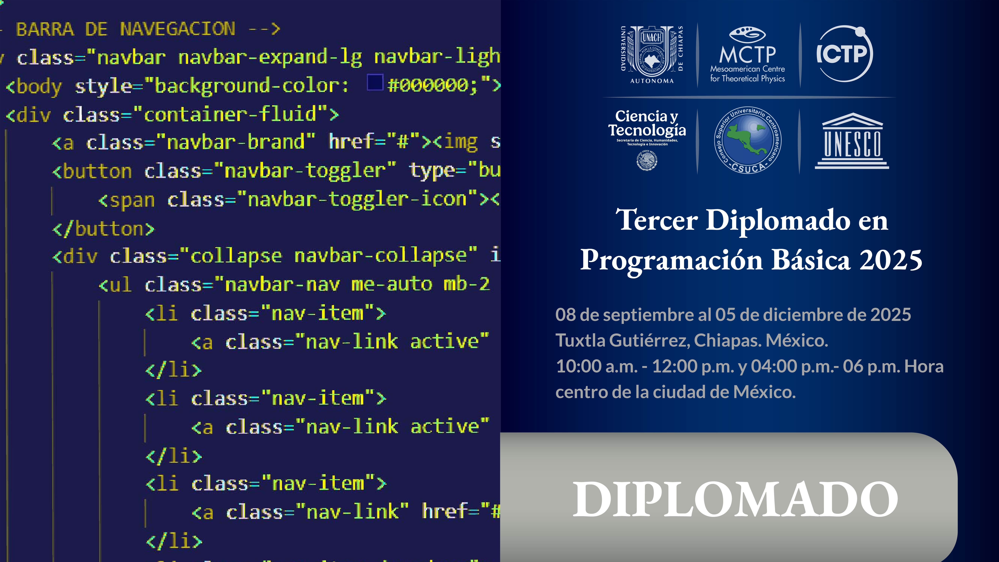

  <h1>Tercer Diplomado en Programación Básica 2025</h1>
    
  <h2>Repositorio Personal</h2>

Para cualquier actualización o contacto relacionado con el Diplomado, mantente atento a este repositorio. Puedes seguir el progreso y las actualizaciones mediante los enlaces a continuación.

 
  

---

## Descripción del Diplomado

El <strong>International Centre for Theoretical Physics (ICTP)</strong>, centro de categoría uno de la <strong>UNESCO</strong>, a través del <strong>Mesoamerican Centre for Theoretical Physics (MCTP)</strong> con sede en la <strong>Benemérita Universidad Autónoma de Chiapas (UNACH)</strong>, convoca a estudiantes y docentes de México, Centroamérica y el Caribe a participar en el <strong>Tercer Diplomado en Programación Básica 2025</strong>, en modalidad <strong>virtual</strong>. Este diplomado tiene como objetivo introducir a los participantes en las ciencias computacionales y fortalecer sus capacidades en áreas relacionadas con la programación.

    El Diplomado consta de tres cursos intensivos de <strong>36 horas</strong> cada uno y cubre temas fundamentales en programación básica en <strong>Python</strong>, <strong>Mathematica</strong> y <strong>C++</strong>.

---

## Cursos

- **[Programación en Mathematica]()**
- **[Programación en C++]()**
- **[Programación en Python]()**

---

## Requisitos

- Registro en el formulario: [Formulario de Registro](https://mctp.mx/forms/tercer-diplomado-en-programacion-basica-2025/)
- Presentarse a la entrevista virtual.
- Disponibilidad de horario.
- Computadora con los programas:
  - **Python** (Anaconda)
  - **Wolfram Mathematica**
  - **C++** (Zinjal)

---

## Fechas Importantes

- **Entrevistas:** 28 y 29 de agosto de 2025
- **Inicio del curso:** 08 de septiembre de 2025
- **Fin del curso:** 05 de diciembre de 2025
- **Fecha límite de registro:** 22 de agosto de 2025
- **Presentación de proyectos final:** 09 de diciembre de 2025

**Costo:** **Gratuito**

Para más detalles, visita el sitio web:  
[https://learning.mctp.mx/tercer-diplomado-en-programacion-basica-2025/](https://learning.mctp.mx/tercer-diplomado-en-programacion-basica-2025/)

---

## Contacto

 **MCTP - Mesoamerican Centre for Theoretical Physics**  
* :email: **Correo Electrónico:** [info@mctp.mx](mailto:info@mctp.mx)  
* :phone: **Teléfono:** +52 961 617 80 00 Ext. 8200  
* :pushpin: **Dirección:** Edificio "C", Ciudad Universitaria UNACH, Carretera Emiliano Zapata, Km 4, C.P. 29050. Tuxtla Gutiérrez, Chiapas, México.

---

## Licencia

Este repositorio está bajo la **Licencia MIT**. Puedes usar, modificar y distribuir el material bajo los términos de esta licencia.

Para más detalles sobre la licencia, consulta el archivo **[LICENSE](./LICENSE)** en este repositorio.

---
<!--
## Seguimiento

    
    
    

-->

    
    
    

    

